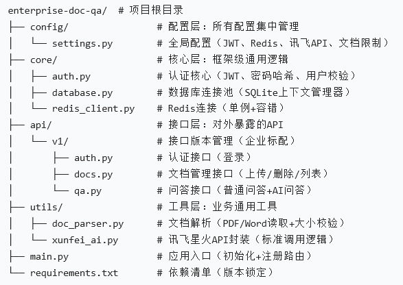

<<<<<<< HEAD
模块 1：FastAPI 接口基础（最核心，必懂）
要搞懂的问题（对着代码找答案）：
1.@app.get("/")、@app.post("/upload-document") 是什么？（答案：FastAPI 的「路由装饰器」，用来定义接口的请求方式和路径）
2.UploadFile = File(...) 是干嘛的？（答案：接收前端上传的文件，FastAPI 封装的文件上传对象）
3.HTTPException(status_code=400, detail="xxx") 什么时候用？（答案：参数校验失败、业务逻辑出错时，返回指定状态码和提示）
动手改（改完就懂了）：
    把 /upload-document 的接口路径改成 /api/v1/upload（企业里常用版本号）；
    新增一个校验：上传的文档大小不能超过 10MB（提示：用 file.size 判断）；
    改完后运行，测试上传超大文件会不会返回「文件过大」的提示。

模块 2：Pydantic 数据校验（必懂）
要搞懂的问题：
1.class QuestionRequest(BaseModel): question: str 是什么？（答案：Pydantic 模型，用来校验请求体的格式，确保前端传的是字符串类型的问题）
2.如果前端传 {"question": 123} 会怎么样？（答案：Pydantic 会自动把数字转成字符串，或者报错 —— 你可以测试一下）
动手改：
    给 QuestionRequest 加一个校验：question 长度不能少于 2 个字（提示：用 Field(min_length=2)）；
    测试传 {"question": "好"} 会不会报错，传 {"question": "后端怎么做"} 会不会成功。

模块 3：数据库操作（懂基础就行）
要搞懂的问题：
1.sqlite3.connect("docs.db") 是干嘛的？（答案：连接 SQLite 数据库文件，不用装服务，新手友好）
2.cursor.execute("INSERT INTO ...") 是执行什么？（答案：SQL 插入语句，把文档信息存到数据库）
3.conn.commit()、conn.close() 能不能省略？（答案：commit 不能省，否则数据存不上；close 最好加，释放连接）
动手改：
    给 documents 表加一个字段 file_size，存储上传文件的大小；
    上传文档时，把 file.size 也存到数据库里；
    改 /documents 接口，返回结果里加上 file_size。

1. 这个项目的核心功能是什么？
（示例答案）：“这个项目是用 FastAPI 做的智能文档问答系统，用户可以上传 PDF/Word 文档，然后输入问题，系统会从文档里找答案，还加了登录认证和缓存，避免随便访问和重复查询。”
2. 你为什么用 FastAPI，而不是 Django/Flask？
（示例答案）：“FastAPI 比 Flask 快，还能自动生成接口文档（/docs），调试很方便；而且它和 Pydantic 结合得好，数据校验不用自己写很多 if/else，适合做接口开发。”
3. 你在项目里遇到了什么问题，怎么解决的？
（示例答案）：“一开始上传空文档会报错，我就加了内容校验，判断提取的文本是不是空的；后来发现每次查问题都要读数据库，速度慢，就加了 Redis 缓存，把高频问题的答案存起来，10 分钟过期。”
4. 这个项目有什么可以优化的地方？
（示例答案）：“现在用的是 SQLite，并发高了会慢，可以换成 MySQL；AI 问答现在只支持讯飞星火，还可以加多模型支持，比如 OpenAI；另外可以加个简单的前端页面，让用户操作更方便。”

如果面试官问你没改、没懂的模块（比如 Redis、OAuth2），不用慌，坦诚说：
“这个 Redis 缓存是我学习的时候加的，主要是为了提升查询性能，我懂它的核心作用是缓存高频结果，减少数据库压力，也亲手测试过缓存命中和过期的逻辑，不过底层的 Redis 原理我还在学习中。”
面试官不会要求实习生懂所有底层，只要你能说清「这个技术是干嘛的、你怎么用的、解决了什么问题」，就够了 ——坦诚比装懂更加分。



写在简历里：
描述为 “实现基于 Redis 的问答缓存机制，支持远程 Redis 配置（含 SSL / 密码鉴权），兼容 Mock 模式适配测试场景”—— 既体现了工程化思维，又不用提 “免费实例”；
面试时讲解：
说清 Redis 缓存的设计思路（减少重复查询、提升响应速度）；
主动提 “为了适配不同环境，做了 Mock Redis 和远程 Redis 的兼容，测试环境用 Mock，生产环境可配置远程 Redis”—— 这会远超同阶段实习生的水平。

「我这个项目一开始只是个简单的文档问答 demo，但我发现没有异常处理会崩溃，所以补充了文件读取、数据库操作的异常捕获；」
「考虑到企业场景需要权限控制，我集成了 OAuth2 认证，保证只有登录用户能操作文档；」
「为了提升查询效率，我用 Redis 缓存了高频问答结果，减少数据库查询压力；」
「最后接入了讯飞星火的 API，把关键词匹配升级成了语义问答，更贴近实际使用场景。」

在main.py中：
    CREATE TABLE IF NOT EXISTS：
        意思是 “如果表不存在就创建”，即使项目重启，也不会覆盖已有数据（比如你之前上传的文档、创建的员工账户都还在）。
    管理员初始化逻辑：
        cursor.execute("SELECT * FROM user_info WHERE username = 'admin'") 先查有没有 admin 账户，只有没有时才创建 —— 避免每次启动都重复插入 admin，导致数据库报错。
    一次连接，多次执行 SQL：
        整个函数只调用 sqlite3.connect() 一次，执行完所有表的创建 / 初始化后，再 commit() + close() —— 比分开连接两次数据库效率更高。
=======
# FastAPI-RAG-Spark
**企业级智能文档问答系统** —— 基于 RAG (Retrieval-Augmented Generation) 架构，集成讯飞星火大模型与高性能向量数据库，实现私有知识库的精准问答。
---

## 核心特性 (Key Features)
- **异步高性能后端**：基于 **FastAPI** 异步框架，支持高并发接口请求。
- **混合问答模式**：
  - **知识库模式**：通过 **FAISS** 检索本地文档，结合上下文生成专业回答。
  - **通用模式**：当检索内容不相关时，自动切换至大模型通用对话模式（智能兜底）。
- **多格式文档支持**：自动化解析 PDF、Word、TXT 格式文档并进行语义分片。
- **工业级安全**：采用 **bcrypt** 加密存储，实现基于角色的访问控制 (RBAC)。
- **响应加速**：集成 **Redis** 缓存热点问答，大幅降低 API 调用成本及响应延迟。

---

## 系统架构
1. **数据层**：SQLite (元数据) + FAISS (向量索引)。
2. **检索层**：使用 `sentence-transformers` 进行语义嵌入 (Embedding)。
3. **生成层**：对接讯飞星火 Spark Lite 接口，通过 Prompt Engineering 引导回答。

---

## 技术栈
| 类别 | 技术选型 |
| :--- | :--- |
| **Web 框架** | FastAPI (Python) |
| **向量库** | FAISS |
| **大模型 API** | iFLYTEK Spark Lite |
| **数据库** | SQLite (Metadata), Redis (Cache) |
| **文档处理** | pdfplumber, python-docx |
| **安全性** | Bcrypt, JWT |

---
##
1. 环境准备
确保已安装 fastapi 且配置好 Redis。
2. 安装依赖
```bash
pip install -r requirements.txt
>>>>>>> 68e1dfd5cc64545e42ebdbfef6c36b6409fe87b6
